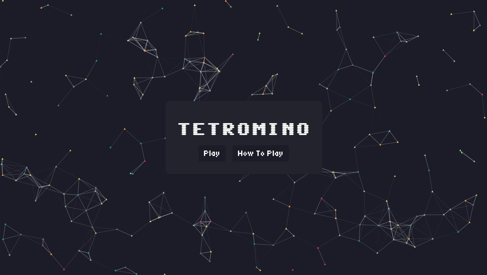
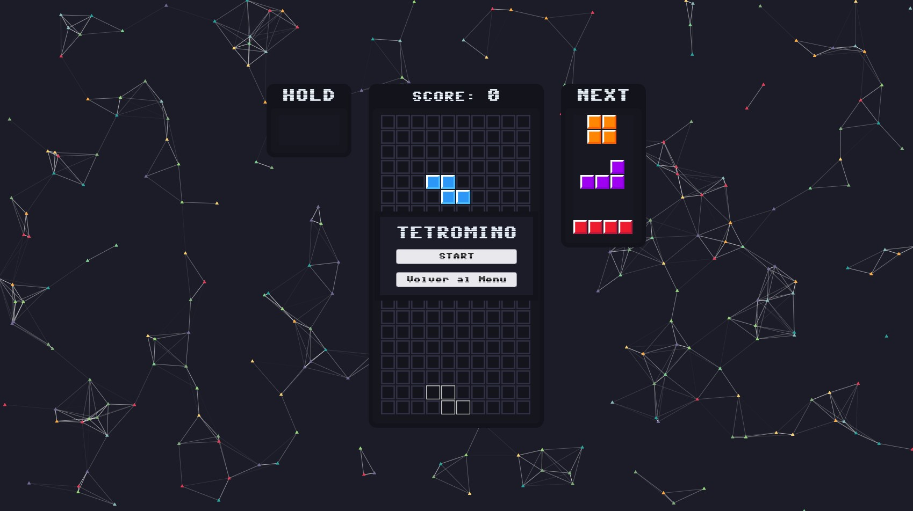
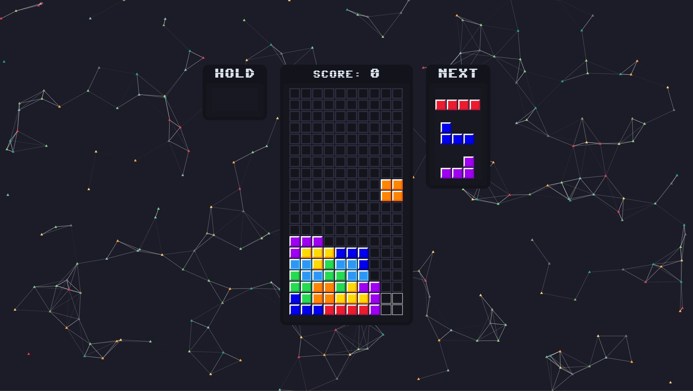

# 🎮 Tetromino — Classic Puzzle Game in JavaScript

Welcome to **Tetromino**, a simple and colorful implementation of the classic Tetris game using HTML5 Canvas and Vanilla JavaScript! 🎉

🧩 Arrange falling blocks into full lines.  
🕹️ Play with your keyboard.  
💾 Fully resettable.  
🎨 Includes Hold and Next Piece previews!

---

## 🚀 How to Play

- ▶️ **Start the Game:** Click the **Start** button!
- ⬅️ ➡️ **Move:** Use **Left / Right Arrow** keys to move pieces.
- ⬇️ **Soft Drop:** Press **Down Arrow** to move faster.
- ⬆️ **Rotate:** Use **Up Arrow** to rotate the piece (clockwise).
- ␣ **Hard Drop:** Press **Spacebar** to instantly drop the piece.
- 🅒 **Hold:** Press **C** to hold the current piece.

---

## 🧠 Features

- 📦 **Tetromino Bag System** – 7-bag shuffle for fair randomness.
- 👻 **Ghost Piece** – See where your piece will land.
- 💾 **Hold System** – Save and swap a piece!
- 🔢 **Score Tracking** – Earn points for clearing lines.
- ❌ **Game Over Detection**
- 🔁 **Resettable** – Start a new game any time!

---

## 🖥️ Tech Stack

- **JavaScript** (ES6+)
- **HTML5 Canvas**
- **CSS**
- Optional: `particles.js` for visual effects ✨

---

## 🎨 Screenshots

### 🧊 Game Menu  
This is the **main menu** where you can start the game.  

---

### 🎛️ Controls & Options  
The **hold/next piece** UI and score tracking are visible here.  

---

### 🎮 Gameplay  
Here’s the actual **Tetris gameplay** in action!  

---

## 🚀 Play Now

  

